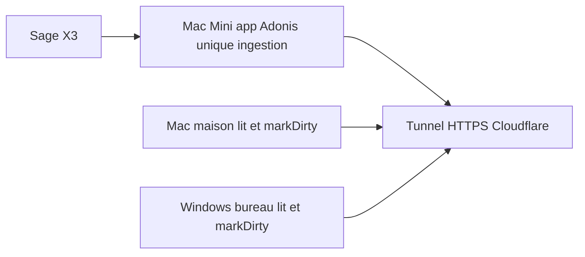

# Une base à la maison, plus de sync le matin

Note d’architecture : partager l’état SQLite entre le Mac (dev), le Windows du
bureau (usage) et le Mac Mini (always-on, accès X3). **Pas encore implémenté.**
Corrigée le 13/08/2026 après relecture contre le code (section « Revue » en bas).

## En une phrase

Le Mac Mini devient **le seul à ingérer** X3 dans la base. Le Mac et le Windows
du bureau **lisent** (et marquent la réplique sale après un write-back). Plus de
copie de fichiers ni d’ingestion SOAP chaque matin.

## Le problème

Trois machines, un fichier local par machine (`tmp/db.sqlite3` et
`tmp/replica.sqlite3`, voir `config/database.ts`) :

- **Mac à la maison** — dev
- **Windows au bureau** — usage réel, X3 en LAN usine (issue #116). Rien à
  installer dessus (pas de Tailscale)
- **Mac Mini à la maison** — allumé en permanence, accès X3, joignable en SSH
  depuis le Mac (`ssh mac-mini` → `192.168.1.84`)

Chaque matin : copier les fichiers, attendre X3, brancher le VPN. Ce n’est pas
que SQLite soit « trop petit ».

En prod Windows, `app.tmpPath()` vaut `build/tmp` : un redéploiement **efface**
les bases (piège #116). Les sortir du process fait disparaître ce piège.

Volumes au 13/08/2026 : `demand_snapshots` = 396 204 lignes sur **12** dates
(~33 k/jour), `tmp/db.sqlite3` 64 Mo, `tmp/replica.sqlite3` 75 Mo.

## La solution

1. Petit serveur de base **libSQL (`sqld`)** sur le Mini, gratuit. Une instance
   `sqld` = **une** base. Deux databases (applicative + réplique) = deux
   instances (deux ports, deux règles de tunnel) **ou** `--enable-namespaces`
   (routage par en-tête `Host` → **deux hostnames** Cloudflare, deux jetons).
   À trancher à l’étape 1, pas au branchement de l’app. Dialecte libSQL dans
   Lucid 22.4 (`npm i @libsql/client`) — stub déjà commenté dans
   `config/database.ts`.
2. Le Mini fait tourner **l’app Adonis**, pas un cron nu. `launchd` relance le
   process au boot. Les cadences restent celles de
   `replica_sync_provider` (`SCHEDULE`) : 5 min pour 3 tables, 10 min / 2 h / 6 h
   / quotidien pour les cinq autres. Un `node ace replica:sync` toutes les 5 min
   n’ingère que `orders-flux`, `stock`, `receptions` — les autres se périment et
   `ReplicaGate` les renvoie en X3 en permanence.
3. Tunnel **Cloudflare** installé **seulement sur le Mini**. Le Windows ouvre une
   URL HTTPS, comme pour X3. Rien à installer au bureau.
   Le hostname public **est** joignable depuis internet : le jeton libSQL (bearer
   dans le `.env` de chaque machine) est le rempart, pas « la base reste chez
   nous ». Cloudflare termine le TLS à son edge. En durcissement : Cloudflare
   Access + service token en en-tête (compatible « rien à installer sur le
   Windows »).
4. **Un seul écrivain d’ingestion : le Mini.** Plusieurs écrivains de
   **marquage** : `markDirty()` part d’un chemin HTTP
   (`suggestion_firm_controller.ts`, affermissement). Le Windows du bureau écrit
   donc aussi dans la réplique. Sous `sqld` c’est sérialisé ; si on l’oublie, un
   affermissement au bureau ne marque rien et la donnée périmée continue d’être
   servie.

Les ticks d’ingestion sont éteints sur Mac et Windows. Le tick photo
(`demand_snapshot_provider`) écrit dans la base **applicative** : il ne s’éteint
sur les lecteurs **qu’une fois** cette base aussi sur le Mini (sinon la photo
nocturne se prend dans le `db.sqlite3` du Mini, invisible ailleurs — #74 cassé).

## Rapidité vs X3 direct

Chiffres déjà mesurés dans l’app :

- **X3 SOAP** : 3 lignes ont déjà pris 19,7 s. Écran froid : 22 à 86 s.
  Ingestion des 3 tables chaudes : ~29 s (13,4 + 12,7 + 2,8 s).
- **Réplique fichier local** : lecture indexée ~4 ms (`cache_preheat_provider.ts`).
- **Réplique via le tunnel** : **à mesurer avant de basculer le bureau.** Ce qui
  compte n’est pas une requête, c’est leur nombre par écran. Le compteur est
  `dualSourceRead` : **3 allers par source** — `verdict()` en fait 2
  (`replica_dirty` + `ingestion_log`), plus la requête de données. Un écran qui
  tire 4 sources = ~12 round-trips. (`verdicts()` et ses 16 requêtes ne comptent
  pas : diagnostic seul — `replica:sync --status`, page admin.)

Le cache n’est pas « préchauffage éteint » : `dualSourceRead`
(`board_dataset.ts:127-148`) décide **au-dessus** du cache. En mode réplique on
ne touche jamais `board()`. Placement délibéré : `canRead()` dans la factory
faisait payer `SuperJSON.parse` (22–93 ms) par-dessus 4 ms. Doctrine : deux
architectures **entières, exclusives**.

Si la mesure dit que le tunnel est trop lent, la réponse n’est pas rallumer
`cache_preheat_provider`. C’est rouvrir `dualSourceRead` et **assumer un
troisième mode** (réplique distante + cache) que le code refuse aujourd’hui.
Étape 4 = arbitrage d’architecture, pas un réglage.

## Dégradation (Mini / tunnel down)

Si le Mini est down **aujourd’hui**, `ReplicaGate` **ne replie pas** sur X3 : il
interroge `ingestion_log` / `replica_dirty` **dans** la réplique. Tunnel coupé =
exception, pas `source: 'direct'`. « Injoignable » n’existait pas tant que la
réplique était un fichier local. Il faut un sixième motif `unreachable` (timeout
court) **dans** `verdict()`, pas chez les appelants — même règle que
`MAX_AGE_MS`.

Sans ce motif : tunnel coupé = app cassée, pas « plus lente ». Et ça ne couvre
que la réplique. Après bascule de la base applicative, tunnel coupé = pas de
`users` = **pas de login**. La dégradation « plus lent, pas cassé » ne vaut que
pour la réplique (recréable). L’applicatif, lui, n’a pas de repli.

## Deux fichiers, pas un

Séparation volontaire (`config/database.ts`) : SQLite n’admet qu’un écrivain par
fichier. Une ingestion de 21 k lignes ne doit pas bloquer `print_jobs` /
scénarios. Sous `sqld` c’est encore du SQLite : la règle ne bouge pas.

Chemins ci-dessous = ceux d’**aujourd’hui**. Après bascule, les deux vivent dans
l’arborescence de données de `sqld` sur le Mini.

- **Réplique** (`tmp/replica.sqlite3`, 75 Mo) — copie récente de X3. Recréable.
  Le Mini l’ingère.
- **Applicative** (`tmp/db.sqlite3`, 64 Mo) — users (mot de passe X3 chiffré),
  scénarios, impressions, photos de besoin (`demand_snapshots` : 396 204 lignes /
  12 jours, irrécupérables — X3 ne versionne pas).

Si on ne partage que la réplique, la copie du matin **reste**. Les deux vivent
sur le Mini.

Sauvegarde : `launchd` quotidien **sur le Mini**, `VACUUM INTO` vers un disque
externe, **sur le fichier de données de `sqld`** — plus `tmp/`. Le protocole
libSQL n’exécute pas `VACUUM INTO` côté client : ça ne passe **pas** par le
tunnel. Viser encore `tmp/db.sqlite3` copierait un fichier mort, en silence.

## Ce qu’on ne fait pas

- **Pas Tailscale sur le Windows du bureau** — impossible à installer. Inutile :
  HTTPS suffit.
- **Pas Turso / Neon « gratuit »** — un swap complet toutes les 5 min
  (DELETE+INSERT × 21 k lignes × 12/h × 24 × 30) ≈ 363 M d’écritures/mois.
  Free Turso = 10 M, puis `BLOCKED`. Grief = quota, pas « les données restent
  chez nous » (le tunnel Cloudflare les fait aussi transiter chez un tiers).
- **Pas coller les deux bases en une.**
- **Pas deux ingestions** (Mini + Windows qui synchro en même temps). Le
  marquage `markDirty`, lui, part de plusieurs machines.
- **Pas de SQL direct vers l’Oracle X3** — doctrine du repo, SOAP uniquement.
- **Pas un cron `replica:sync` toutes les 5 min à la place du provider.**

## Quand on implémentera

Ordre, rien de tout ça n’est fait :

1. `sqld` + app Adonis + `launchd` (keep-alive, pas cadence) + tunnel Cloudflare
   **sur le Mini seulement**, préparé en SSH depuis le Mac maison. Rien à
   installer au bureau. Cloudflare Access si on durcit.
2. Motif `unreachable` dans `ReplicaGate.verdict()` — **avant** tout lecteur
   distant. Sans lui, tunnel down = crash, pas repli X3.
3. L’app lit une URL libSQL au lieu d’un fichier (`LIBSQL_URL`). **Bascule des
   deux bases ensemble** (ou applicative d’abord) : éteindre
   `demand_snapshot_provider` sur les lecteurs tant que `db.sqlite3` est local
   casse la photo à date. **`VACUUM INTO` quotidien seulement ici** : à l’étape 1
   la base `sqld` est vide, sauvegarder n’y copierait rien.
4. Mesurer le coût d’un écran via le tunnel (nombre de round-trips, pas une
   requête). Si trop lent : **pas** rallumer le préchauffage — instruire un
   troisième mode (`dualSourceRead` + cache) que le code refuse aujourd’hui.
   Sinon le tunnel tient sans cache.
5. Essai Mac maison.
6. Essai Windows bureau, tunnel coupé : vérifier `unreachable` → X3 LAN pour la
   réplique, et que le login (base applicative) a un comportement **nommé**
   (mort assumée, ou copie locale de secours — à trancher).

La CI reste sur SQLite jetable (`.github/workflows/ci.yml`).

---

## Revue du 13/08/2026

Relecture contre le code cité (Lucid 22.4, `replica_gate.ts`,
`replica_sync.ts:124-141`, `replica_sync_provider.ts` `SCHEDULE`,
`suggestion_firm_controller.ts:64`, `demand_snapshot_provider.ts:16`,
`cache_preheat_provider.ts:92`). Décision de fond conservée. Quatre erreurs
factuelles et deux trous d’ordre **pliés dans le texte ci-dessus** :

1. `ReplicaGate` ne replie pas si la réplique est injoignable — motif
   `unreachable` à ajouter.
2. Un cron 5 min n’ingère que 3 tables sur 8 — le Mini court l’app, pas le CLI.
3. Le tunnel est public ; le grief Turso est le quota, pas la localisation.
4. Un seul écrivain d’**ingestion**, plusieurs de **marquage**.
5. Ne pas éteindre le tick photo avant que l’applicatif soit sur le Mini.
6. Pas de repli login ; sauvegarde `VACUUM INTO` obligatoire.

## Relecture du 13/08/2026 — 2e passe

Chiffres et six points : OK. Trois sous-estimations **pliées dans le texte** :

1. Deux databases sous `sqld` = deux instances **ou** namespaces + deux
   hostnames Cloudflare. Trancher à l’étape 1.
2. `VACUUM INTO` sur le fichier `sqld` du Mini, en local, pas via le tunnel, pas
   `tmp/`.
3. Rallumer le cache = rouvrir `dualSourceRead`, pas le préchauffage. Étape 4 =
   arbitrage d’architecture (troisième mode), pas un réglage.

## Relecture du 13/08/2026 — 3e passe

Corrections d’Opus dans le corps, vérifiées :

1. Compteur écran = `dualSourceRead` : **3 allers/source** (`verdict` = 2 +
   requête métier). `verdicts()` 16 req = diagnostic, pas le chemin écran.
2. Chemins `tmp/` = aujourd’hui. Après bascule : arborescence `sqld` sur Mini.
3. `VACUUM INTO` à l’étape 3, pas 1 — à l’étape 1 la base `sqld` est vide.
