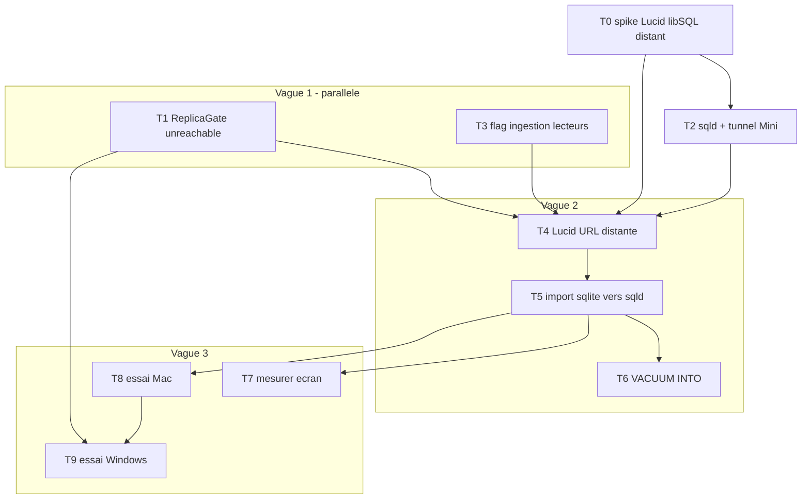

# Plan : base Mini, plus de sync matin

Source : [faisabilite-db-externe.md](faisabilite-db-externe.md). Décisions figées
ici pour ne pas les rejouer dans chaque tâche.

**Décisions (ne plus rouvrir) :**

- Deux **instances `sqld`**, deux ports, deux hostnames Cloudflare — pas
  `--enable-namespaces`.
- Cloudflare **Access** + service token dès le tunnel (données usine, hostname
  public) — **sous réserve de T0** : le driver doit pouvoir émettre les en-têtes
  `CF-Access-Client-Id` / `CF-Access-Client-Secret`. S’il ne peut pas, le bearer
  libSQL reste le seul rempart et il faut le dire.
- Tunnel down après bascule applicative : **page d’erreur nommée**, pas de copie
  locale de `users`.
- 3e mode (réplique distante + cache) : **hors scope** tant que la mesure (T7)
  n’a pas échoué.
- CI : SQLite fichier inchangé.

**Non décidé, et bloquant : Lucid sait-il attaquer un `sqld` distant ?** Le
dialecte `libsql` de Lucid charge `@libsql/sqlite3` (pas `@libsql/client`) et son
type de config est `connection: { filename }` — ni `url`, ni `authToken`,
`replicas?: never`. Le stub commenté de `config/database.ts` vient de la doc
Turso, pas du paquet. Tout le plan en dépend : d’où T0.



Ordre d’attaque : **T0 d’abord** — il conditionne T2 et T4. **T1 + T3 en
parallèle de T0** (pur code app, indépendants de la réponse). Puis T2, puis T4,
puis T5. **T6 et T7 après T5** : à base vide, une sauvegarde ne copie rien et une
mesure ne mesure que le RTT. T8 puis T9.

---

## T0 — Spike : Lucid parle-t-il à un `sqld` distant ?

**Bloquant pour T2 et T4.** Une heure, pas une PR — un spike jeté.

### Outcome

Réponse binaire écrite dans `faisabilite-db-externe.md` : Lucid attaque un `sqld`
distant authentifié, ou pas. Si non : quelle voie de rechange, et T2/T4/T5 sont à
réécrire avant d’être lancés.

### Context

`node_modules/@adonisjs/lucid/build/src/clients/libsql.cjs` étend le client
`sqlite3` de knex et charge `@libsql/sqlite3` — le drop-in **fichier** de
node-sqlite3. `types/database.d.ts` : `connection: { filename: string; flags?;
debug?; mode? }`, `replicas?: never`. Aucune trace d’`url` ni d’`authToken`.

Trois issues possibles, à trancher par le spike :

1. `@libsql/sqlite3` accepte une URL `libsql://` / `http://` comme `filename`
   (jeton en query string ou en option) → le plan tient tel quel.
2. Il faut passer par `@libsql/client` avec un dialecte knex maison → T4 change
   de taille, ce n’est plus « décommenter un stub ».
3. Rien de tout ça ne marche → l’architecture change : API HTTP servie par l’app
   du Mini au lieu d’un protocole DB exposé. Le reste du plan tombe.

### Constraints

Aucune modification de `config/database.ts` livrée dans cette tâche. `sqld` local
sur le Mac, pas le Mini : on teste le driver, pas le réseau.

### Acceptance criteria

- `sqld` local + une connexion Lucid + `SELECT 1` : marche ou ne marche pas.
- En-têtes HTTP arbitraires (`CF-Access-Client-*`) : émettables ou non. Réponse
  écrite, elle décide de la ligne « Access » des décisions.
- Verdict et voie retenue consignés dans `faisabilite-db-externe.md`.

### Checks

Manuel Mac. Jeter le spike ensuite (`git checkout .`), ne rien laisser traîner.

### Out of scope

Mini, tunnel, import des données, code de production.

---

## T1 — Motif `unreachable` dans ReplicaGate

Parallèle vague 1 (et de T0). Une PR.

### Outcome

`sqld` / tunnel down : `verdict()` rend `source: 'direct'`, `reason:
'unreachable'`. Écran X3 LAN, pas d’exception, et **pas d’écran à 6 s**.

### Context

`app/services/replica_gate.ts` `verdict()` lit `replica_dirty` + `ingestion_log`
sans try/catch. « Injoignable » n’existait pas en fichier local. Même règle que
`MAX_AGE_MS` : le motif vit **dans** `verdict()`, pas chez les appelants. Tests :
`tests/unit/replica_gate.test.ts`.

Deux conséquences du passage au distant, dans cette tâche parce qu’elles sont le
même sujet :

- **Coupe-circuit.** Le timeout se paie à CHAQUE `verdict()` : 2 s × 3 sources =
  6 s par chargement d’écran, tunnel down. Mémoriser l’état injoignable quelques
  dizaines de secondes, sinon la dégradation est « pas cassée » mais inutilisable.
- **Marquage perdu.** `markReplicaDirty` (`suggestion_firm_controller.ts`) est en
  `try {} catch {}` muet, justifié par « un échec ici laisse la table marquée
  sale ». Vrai sur fichier local : l’écriture ne peut pas échouer. Faux en
  distant — réplique injoignable = le marquage n’est **jamais posé**. L’écriture
  X3 passe, le tunnel revient, le dernier run complet est récent : la réplique
  sert l’état d’AVANT l’affermissement, sans drapeau. Il faut une trace locale
  persistante rejouée au retour, ou un refus de servir la réplique après un
  `markDirty` échoué.

### Constraints

Cinq motifs existants inchangés. Timeout court (1–2 s). `canRead()` suit
`verdict()`. Le silence de `markReplicaDirty` ne doit pas devenir bloquant pour
l’affermissement : faire échouer une écriture X3 réussie reste le pire des deux
mondes.

### Acceptance criteria

- Connexion réplique qui jette / timeout → `unreachable`, `source: 'direct'`.
- Réplique saine → comportement actuel.
- Deuxième lecture pendant la fenêtre injoignable : pas de nouveau timeout
  (coupe-circuit).
- `markDirty` échoué → la table n’est pas servie tant que l’échec n’est pas
  rattrapé.
- Tests unitaires sans Mini.

### Checks

```bash
npm test -- --files="replica_gate"
npx eslint app/services/replica_gate.ts tests/unit/replica_gate.test.ts
```

### Out of scope

libSQL, Mini, login applicatif, cache.

---

## T2 — Mini : deux `sqld` + launchd keep-alive + tunnel Cloudflare Access

**Après T0** (sa réponse décide de la forme du service exposé et de la
compatibilité Access). Ops SSH, pas une PR app. `ssh mac-mini` → `192.168.1.84`.

### Outcome

Depuis le Mac maison : deux `sqld` joignables en HTTPS authentifié. Rien à
installer sur Windows.

### Context

Une instance `sqld` = une base. Ports distincts (ex. 8080 app, 8081 replica).
`launchd` = keep-alive process, **pas** cadence d’ingestion. Token bearer +
Cloudflare Access.

### Constraints

Pas Tailscale sur Windows. Pas Turso. Données restent fichiers Mini. Pas
d’ingestion X3 dans cette tâche (bases vides OK).

### Acceptance criteria

- Depuis le Mac maison, HTTPS + token : une **vraie requête** aboutit sur les
  deux hostnames (`SELECT 1`, pas un `curl` qui rend 200 sur la racine — un 200
  ne prouve pas que la base répond).
- Reboot Mini → `sqld` + tunnel relancés.
- Sans token / sans Access → refus.

### Checks

Manuel : SSH, reboot Mini, curl depuis Mac. Documenter ports, chemins data, noms
tunnel (hors repo si secrets).

### Out of scope

Code Adonis, import des `.sqlite3`, `VACUUM INTO`, app HTTP sur le Mini.

---

## T3 — Flag hôte d’ingestion

Parallèle vague 1. Une PR.

### Outcome

Seul le process avec le flag ouvert tourne `replica_sync_provider`. Mac/Windows
lecteurs : ticks réplique éteints. `markDirty` reste possible partout.

### Context

Aujourd’hui les providers partent dès l’env `web`. Mini = unique écrivain
d’ingestion. Windows affirme encore via HTTP (`suggestion_firm_controller.ts`).
Env : `REPLICA_INGEST=true` seulement Mini.

**Défaut du flag, à énoncer et pas à laisser implicite.** Absent = fermé : le Mac
de dev (`.env` local avec `REPLICA_READS=true`) cesse d’ingérer dès cette PR et,
entre T3 et T5, sa réplique se périme — `ReplicaGate` la renvoie en X3 direct.
Dégradation visible et sans danger, mais elle doit être voulue, pas subie. Poser
`REPLICA_INGEST=true` dans le `.env` du Mac tant que T5 n’est pas passée.

**`reingestOrders` : à trancher ici.** `markReplicaDirty` appelle `markDirty()`
**puis** `replicaSyncService.reingestOrders(numOfs)` — donc une extraction SOAP
X3 **et** une écriture réplique, depuis le chemin HTTP, donc depuis le poste qui
affermit. Après bascule, un affermissement au bureau lance une ingestion X3
depuis le bureau qui écrit dans la réplique du Mini à travers le tunnel. Ça
contredit « un seul écrivain d’ingestion ». Deux options, à choisir maintenant :

- **la garder** — c’est elle qui referme la fenêtre sale en ~1 s au lieu d’un
  tick ; assumer alors que « un seul écrivain » vaut pour les ticks, pas pour la
  ré-ingestion ciblée ;
- **la déléguer au Mini** — le lecteur marque, le Mini ré-ingère au tick suivant ;
  fenêtre sale plus longue, doctrine intacte.

Photo #74 : **ne pas éteindre** `demand_snapshot_provider` tant que T5 n’a pas
basculé l’applicatif. Ici : ingestion **réplique** seulement.

### Constraints

Pas deux `syncAll()` concurrents. `markDirty` non gardé par le flag.

### Acceptance criteria

- Flag fermé → aucun tick réplique, `markDirty` OK.
- Flag ouvert → `SCHEDULE` inchangé (5 min / 10 min / 2 h / 6 h / quotidien).
- Sort de `reingestOrders` décidé et écrit dans le code (commentaire) comme dans
  `faisabilite-db-externe.md`.
- Test sans Mini.

### Checks

```bash
npm test -- --files="replica_daily_schedule"
```

(et test flag si ajouté) ; typecheck fichiers touchés.

### Out of scope

`LIBSQL_URL`, photo nocturne, Mini.

---

## T4 — Lucid : `LIBSQL_URL` / `LIBSQL_REPLICA_URL`

Après **T0** + T1 + T2 + T3. Une PR. **Taille inconnue tant que T0 n’a pas
répondu** : « décommenter un stub » si T0 rend l’option 1, un dialecte à écrire
si c’est l’option 2.

### Outcome

App lit (et `markDirty`) les deux bases à distance. Fichier local reste le défaut
(CI, dev sans Mini).

### Context

Le stub commenté de `config/database.ts` ne correspond à aucun type Lucid : il
porte `url` + `authToken`, le type `LibSQLConfig` veut `filename`. Le paquet
chargé est **`@libsql/sqlite3`**, pas `@libsql/client`. Voir T0 : c’est lui qui
dit ce qu’on écrit ici. `start/env.ts` : URLs + jetons optionnels. Défaut =
`tmp/*.sqlite3` si absents.

### Constraints

CI SQLite fichier. Deux connexions séparées. STRICT / `ON CONFLICT` / chunks 400
inchangés (encore SQLite). L’`afterCreate` de la connexion `replica`
(`PRAGMA journal_mode` / `busy_timeout` via l’API callback de node-sqlite3) est
lié au driver fichier : vérifier qu’il survit, ou le retirer côté distant où il
n’a plus d’objet.

### Acceptance criteria

- Sans URL : boot actuel.
- Avec URL (`sqld` local puis Mini) : `migration:run` +
  `migration:run --connection=replica` contre un `sqld` **jetable** — pas celui
  qui recevra les données en T5, que l’import écraserait.
- `markDirty` écrit sur la connexion replica distante.

### Checks

`npm run typecheck` ; test boot sans URL ; essai manuel Mac → Mini après T2.

### Out of scope

Import données, mesure perf, 3e mode cache, éteindre la photo.

---

## T5 — Import des deux SQLite + ticks Mini complets

Après T4.

### Outcome

`db.sqlite3` et `replica.sqlite3` vivent dans `sqld`. Mini ingère (réplique +
photo 04 h). Lecteurs : ticks **tous** éteints.

### Context

**Copie à froid d’abord.** C’est la seule étape destructrice du plan, et elle
porte les 396 204 lignes de `demand_snapshots` que X3 ne sait pas reconstruire.
T6 (sauvegarde automatique) vient après — donc au moment de l’import, il n’existe
aucun filet. Première ligne de la tâche : arrêter l’app, copier `tmp/db.sqlite3`
et `tmp/replica.sqlite3` sur un disque externe, vérifier les tailles.

Ensuite : copier/attacher les fichiers (64 Mo + 75 Mo) dans le data dir `sqld`,
ou dump/restore. Puis `REPLICA_INGEST` + photo seulement Mini. Sans ça : photo
dans le `db.sqlite3` local du Mini, invisible (#74).

### Constraints

Copie à froid **avant** tout écrasement. Les deux bases **ensemble** (ou
applicative d’abord). Pas d’ingest sur Mac/Windows après bascule.

### Acceptance criteria

- Copie à froid des deux fichiers sur disque externe, tailles vérifiées, **avant**
  le premier écrasement.
- Users / snapshots / OF répliqués visibles depuis le Mac via tunnel.
- Tick 04 h écrit dans l’applicatif Mini, pas dans un `tmp/` lecteur.
- Chemins `tmp/*.sqlite3` lecteurs : plus source de vérité.

### Checks

Manuel : counts `demand_snapshots`, login, `replica:sync --status` depuis Mini.

### Out of scope

`VACUUM INTO`, essai Windows, mesure.

---

## T6 — Sauvegarde `VACUUM INTO` quotidien

Après T5 (à T2 la base est vide → backup mort).

### Outcome

`launchd` Mini, local, fichiers **data `sqld`**, disque externe. Pas via tunnel.

### Context

Le client libSQL n’exécute pas `VACUUM INTO`.

### Constraints

Pas `tmp/db.sqlite3`. Deux fichiers (app + replica).

### Acceptance criteria

- `VACUUM INTO` à heure creuse → fichiers `.bak` non vides, dates du jour.
- Restauration test : `sqld` relit le backup.

### Checks

Manuel Mini. Taille backup ≈ 64+75 Mo.

### Out of scope

Code app.

---

## T7 — Mesure coût écran via tunnel

**Après T5**, pas après T4. Go / no-go bureau.

### Outcome

Chiffre : latence d’un écran réel (ex. `/programme`) Mac → tunnel, en
**round-trips `dualSourceRead`** (3/source, pas `verdicts()`). Si no-go :
**stop**, instruire 3e mode (autre chantier).

### Context

Compteur brief : 3 allers/source. Cache interdit en mode réplique
(`dualSourceRead` au-dessus de `board()`).

**Pourquoi après T5 et pas après T4** : à T4 le `sqld` est vide. Mesurer dessus ne
donne que le RTT, alors que ce qui inquiète est le **volume** rendu sur l’upload
de la box maison. Un go obtenu sur une base vide serait un faux vert.

### Constraints

Ne pas rallumer `cache_preheat_provider`. Ne pas modifier `dualSourceRead` dans
cette tâche.

### Acceptance criteria

- Chrono : total écran, nb round-trips, p50/p95 d’un aller.
- Verdict écrit dans `faisabilite-db-externe.md` : tient sans cache / ne tient
  pas.

### Checks

Manuel Mac maison, `REPLICA_READS=true`, Mini chaud.

### Out of scope

Implémenter le 3e mode.

---

## T8 — Essai Mac maison

Après T5.

### Outcome

Dev local sans copie de fichiers, sans ingestion locale. VPN X3 seulement pour
write-back.

### Context

`.env` Mac : URLs libSQL + Access, `REPLICA_READS=true`, `REPLICA_INGEST` absent.
Watcher inchangé.

### Acceptance criteria

- Board / programme / ruptures servis depuis Mini.
- Affermissement → `markDirty` sur Mini, prochaine lecture directe jusqu’à
  ingest.
- Mini down → T1 : réplique en X3 (VPN) ; login : page d’erreur nommée.

### Checks

Manuel. Couper tunnel 5 min.

---

## T9 — Essai Windows bureau

Après T8 + T1.

### Outcome

Usage réel sans Tailscale, sans copie matin. Rien d’installé hors l’app. X3 LAN
= repli réplique.

### Context

Même `.env` URLs. `REPLICA_INGEST` fermé. Issue #116 : bases plus dans
`build/tmp`.

### Acceptance criteria

- Écrans OK, HTTPS Access.
- Tunnel coupé : réplique → X3 LAN (`unreachable`) ; login → page nommée, pas
  500 opaque.
- Pas de `replica:sync` local (SOAP Mini seulement).

### Checks

Manuel bureau. Couper Access / Mini. Chrono écran vs T7.

### Out of scope

3e mode cache, Tailscale.
